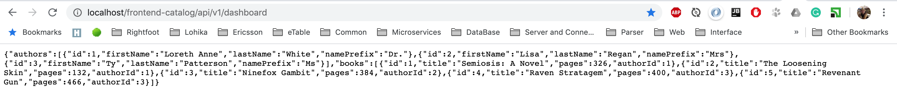
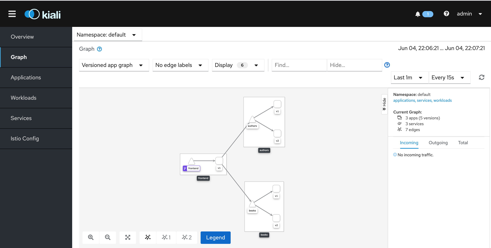
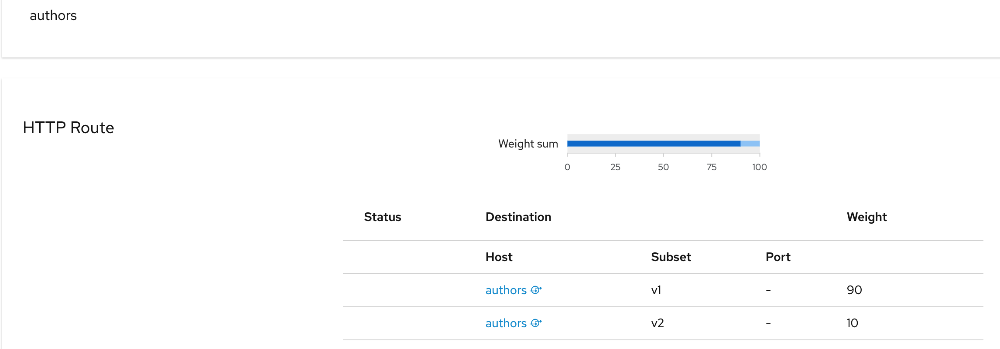
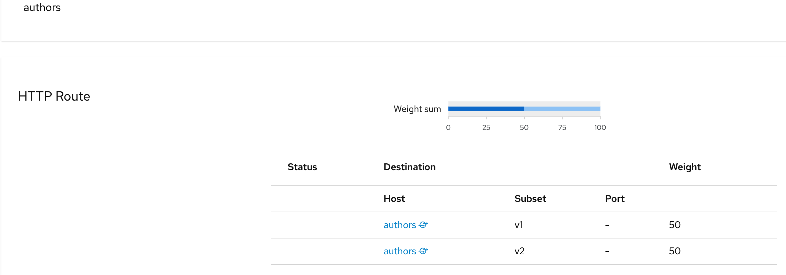
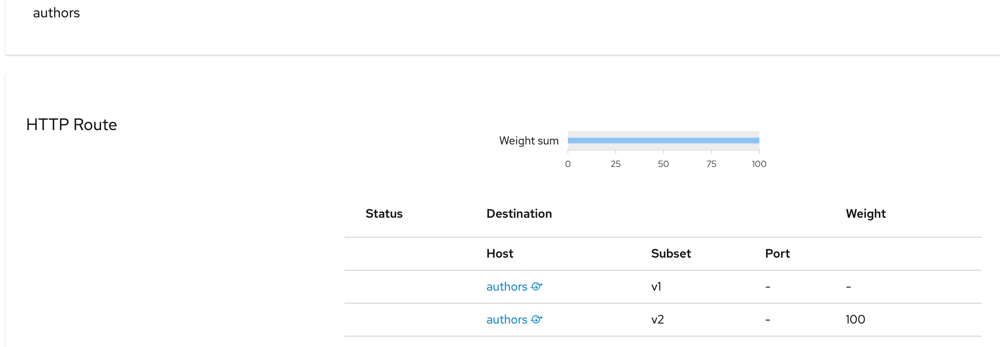
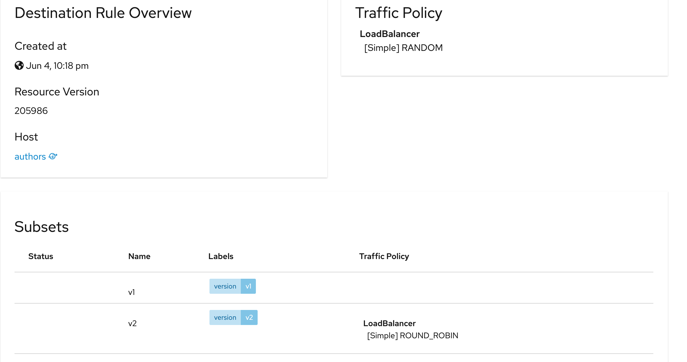
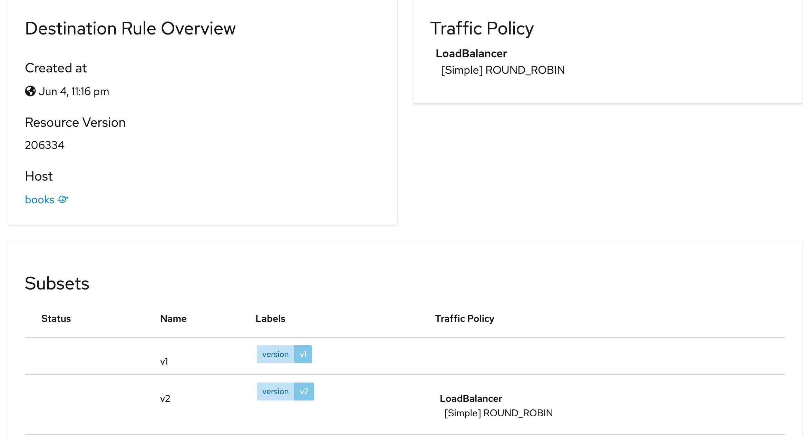
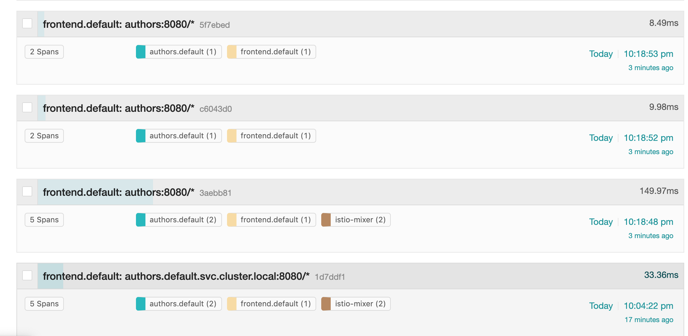

# Istio Cource Homework Session 3

Results
* Add prefix name for Authors and rating for Books
* Push changes to the Docker with version 2
* Create VirtualService to route 10% for v2 and 90% for v1
* Add VirtualService for developer header

### K8s Dashboard

### Kiali

### Jaeger

